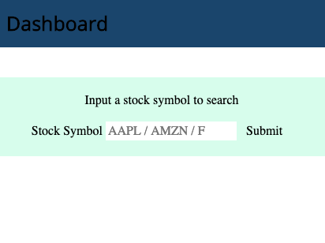
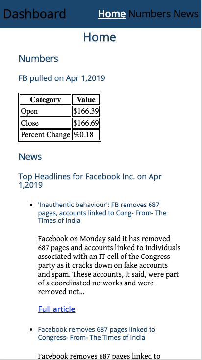
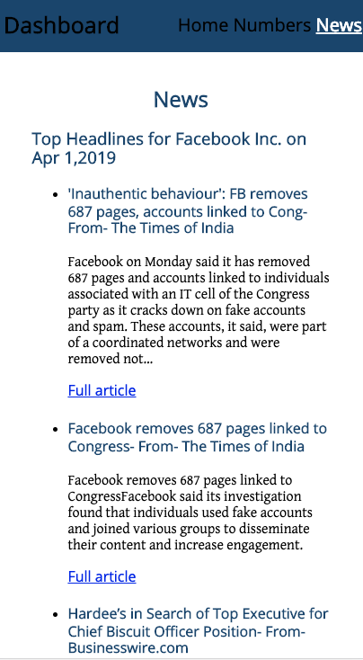
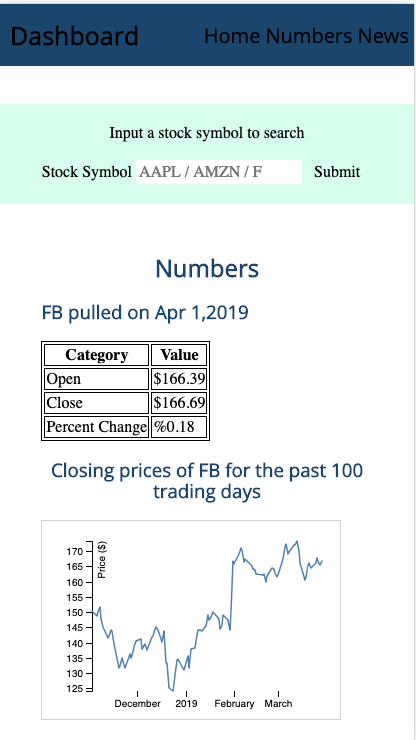
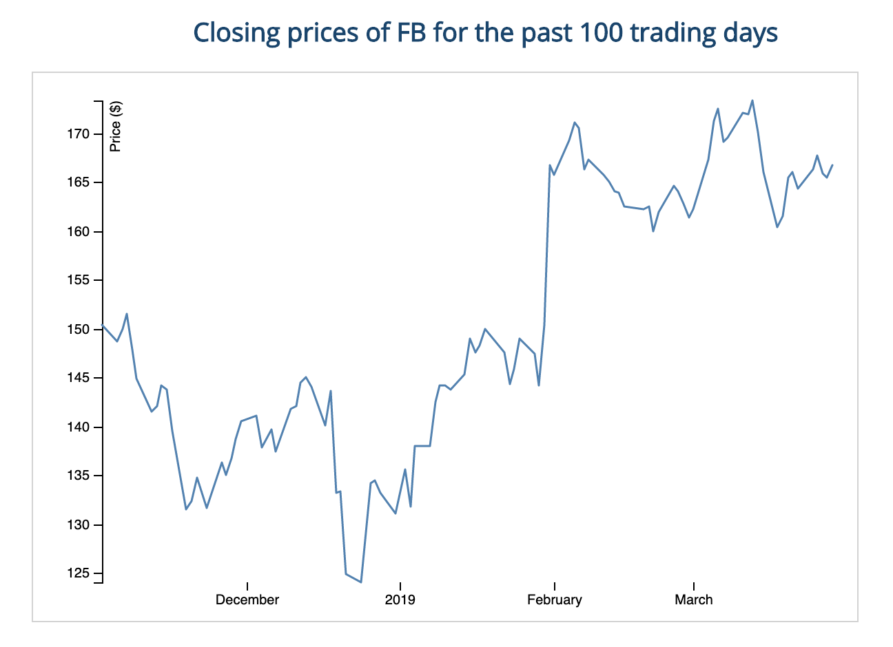
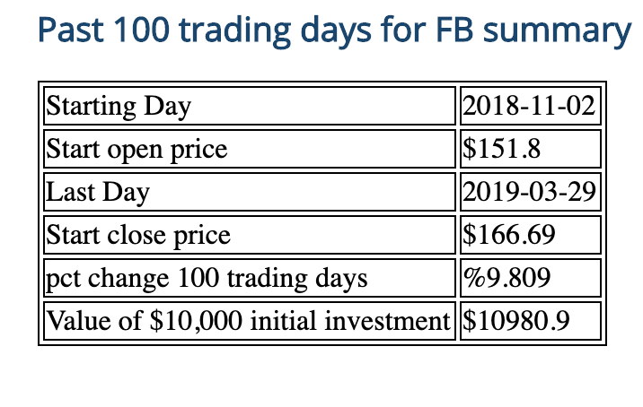

<h1>Stock Dashboard</h1>

A lightweight stock dashboard that allows you to see a stock's last trading day performance, past 100 day performance, and trending news articles of the day.

<h2>Motivation</h2>

I wanted to create a simple lightweight version of Apple's stock dashboard application. Present numerical/graphical information on a stock/company and relevant news about the company.

<h2>API(s) Used:</h2>

1. https://newsapi.org/ 

2. https://www.alphavantage.co/

<h2>Technologies:</h2>

1. HTML
2. CSS
3. Javascript
4. JQuery

<h2>Status</h2>
Live <a href="https://github.com/rtanubra/stock_dashboard" target="_blank" >Github deployment</a>

<h2>Screenshots:</h2>

1. Landing Page

2. Home Page - Mobile Version

3. News Section - Mobile Version

 

4. Numbers Section - Mobile version

5. Line Chart (SVG element) - Full version

6. 100 day performance 

<h2>Current Features:</h2>

1. View the last trading day's performance of a stock.
2. View the last 100 trading day's performance of a stock in graphical or summarized in a table.
3. View latest news surrounding the company of a stock.
4. Search a stock ticker or a company name to produce the same above results.

<h2>Future Feateures:</h2>

1. Toggle between:

    1.1 a simple closing line chart built on the closing prices of a stock.

    1.2 an Open High Low Close (OHLC) /candlestick chart of a stock.

2. Compare stock performance of more than 1 stock per session.
3. Save stocks of interest so a user can conduct a quick search. 

<h2>Author:</h2>

Rey Tanubrata

Github : <a href="https://github.com/rtanubra" target="_blank" >rtanubra</a>

Portfolio Page: <a href="https://rtanubra.github.io/portfolio_ReyT/" target="_blank" > live on github </a>
